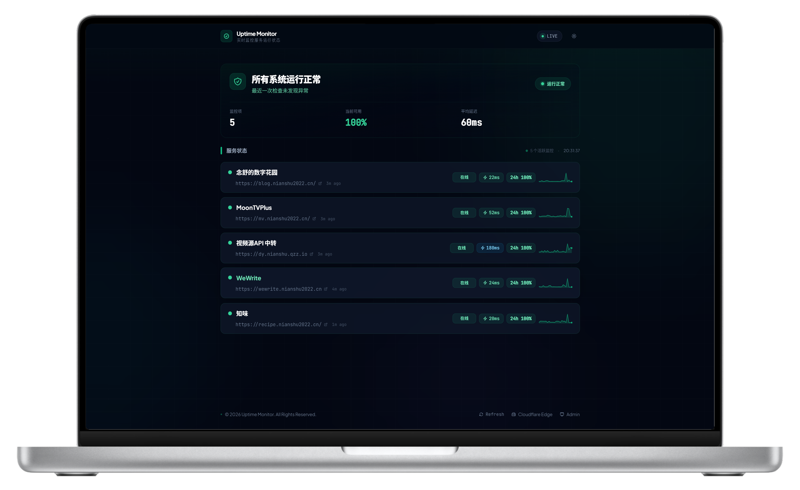
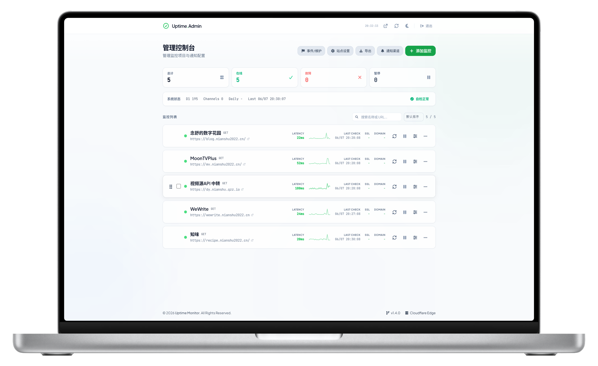

# Uptime Monitor

English | [中文](README.md)

Uptime Monitor is a lightweight website monitoring system built on Cloudflare Workers, Pages, and D1. It supports multi-site uptime checks, SSL certificate and domain expiration checks, multiple notification channels, a public status page, and an admin dashboard. It also works as a **monitoring + bookmark** hub for public sites and internal links.

The project can run within Cloudflare's free tier and does not require a self-hosted server. The frontend uses bundled fonts and icons instead of runtime Google Fonts or icon CDN dependencies, making it friendlier for users in mainland China.

## Who It Is For

- Personal site owners who want to monitor blogs, docs, APIs, image hosts, proxies, or small services.
- Indie developers who need a public status page and alerting dashboard for their own products.
- Small teams that need low-cost monitoring for websites, certificates, domains, and key HTTP endpoints.
- Homelab / hybrid users who want bookmark-only entries for NAS, side routers, or other URLs that cannot be probed from the public internet.
- Cloudflare users who prefer Workers, Pages, and D1 over maintaining a server.

It is not meant to replace large observability platforms with distributed probes, advanced SLO reporting, on-call scheduling, or multi-tenant permission systems.

## Features

### Monitoring and alerts

- HTTP/HTTPS monitoring for multiple sites, with GET/POST, custom headers, request bodies, and keyword checks.
- Check intervals: 1 / 3 / 5 / 10 / 15 / 30 minutes, or **no checks** (bookmark mode).
- SSL certificate and domain expiration monitoring with independent toggles and alert thresholds.
- Notifications through WeCom, Feishu, DingTalk, custom Webhook, Telegram, and Email.
- Configurable alert templates with separate incident and recovery messages; silence windows for uptime, SSL, and domain alerts.

### Status page and bookmarks

- Public status page with tag grouping, incidents, maintenance windows, and custom logo support.
- **Bookmark mode (no checks)**: when interval is set to “no checks”, the entry is shown as a link only and no HTTP probe runs. Useful for internal NAS, side routers, or other unreachable URLs.
- **Visit link**: shown on the status page for clicks; the **check URL is never exposed publicly**.
- **Private monitors**: the public page hides the visit link and shows only name and status.
- Admin entry is available in the status page header, not only in the footer.

### Admin dashboard

- Tags can be picked from existing labels or typed as new comma-separated values.
- Admin dashboard with bulk actions, drag-and-drop sorting, JSON import/export, and health checks.
- Session-based admin authentication so the frontend does not keep a plaintext password.
- `ALLOWED_ORIGIN` support for Worker and Pages proxy CORS hardening.
- GitHub Actions deployment for both Worker and Pages.

### Mode comparison

| Mode | Public page | HTTP checks | Typical use |
|---|---|---|---|
| Normal monitor | Name + visit link + status | Yes | Public websites, APIs |
| Split check / visit URL | Visit link + status (check URL hidden) | Yes | Health endpoint vs login page |
| Bookmark (no checks) | Name + link | No | Internal NAS, side router |
| Private monitor | Name + status, **visit link hidden** | Yes | Sensitive admin panels |
| Bookmark + private | Name only, **link hidden** | No | Sensitive internal links |

## Quick Facts

| Question | Answer |
|---|---|
| Does it need a server | No, it runs on Cloudflare Workers, Pages, and D1 |
| Does it need a database | Yes, Cloudflare D1 |
| Public status page | Yes |
| Admin dashboard | Yes, at `/admin`; also linked from the status page header |
| Bookmark / internal links | Yes, set interval to “no checks” |
| Private monitors | Yes; public page hides visit link |
| Notification channels | WeCom, Feishu, DingTalk, Webhook, Telegram, Email |
| Mainland China friendliness | Frontend assets are bundled locally; WeCom, Feishu, and DingTalk are recommended first |
| Online demo | [https://uptime.nianshu2022.cn](https://uptime.nianshu2022.cn) |

## Online Demo

- Status page: [https://uptime.nianshu2022.cn](https://uptime.nianshu2022.cn)
- Admin dashboard: [https://uptime.nianshu2022.cn/admin](https://uptime.nianshu2022.cn/admin)
- Demo password: `Qwer1234`

The demo password is only for the public demo. Do not use it as your production admin secret.

## Screenshots

<div align="center">
  
  <br>
  <em>Public status page</em>
</div>

<br>

<div align="center">
  
  <br>
  <em>Admin dashboard</em>
</div>

## Tech Stack

| Area | Technology |
|---|---|
| Backend | Cloudflare Workers + Hono |
| Database | Cloudflare D1 |
| Frontend | Vue 3 + Vite + Tailwind CSS |
| Edge proxy | Cloudflare Pages Functions |
| Deployment | Wrangler + GitHub Actions |

## Requirements

- Cloudflare account
- Node.js 22 or later
- npm
- Wrangler CLI

```bash
npm install -g wrangler
wrangler login
```

Clone the repository:

```bash
git clone https://github.com/nianshu2022/Uptime-Monitor.git
cd Uptime-Monitor
```

## Create a D1 Database

Create a database:

```bash
npx wrangler d1 create uptime-db
```

The command output includes a `database_id` value, which is required for deployment:

```toml
[[d1_databases]]
binding = "DB"
database_name = "uptime-db"
database_id = "xxxxxxxx-xxxx-xxxx-xxxx-xxxxxxxxxxxx"
```

Initialize the schema:

```bash
npx wrangler d1 execute uptime-db --remote --file=worker/schema.sql
```

If you already have a D1 database, copy the Database ID from the Cloudflare Dashboard D1 detail page, or run:

```bash
npx wrangler d1 list
```

For existing databases, apply the **incremental migration** statements at the bottom of `worker/schema.sql`. Do not run the full schema file on a live database (it drops tables).

To upgrade to a version with **private monitors**, run:

```bash
npx wrangler d1 execute uptime-db --remote --command="ALTER TABLE monitors ADD COLUMN is_private INTEGER DEFAULT 0;"
```

To upgrade to a version with **split check / visit URLs**, run:

```bash
npx wrangler d1 execute uptime-db --remote --command="ALTER TABLE monitors ADD COLUMN link_url TEXT;"
```

Bookmark mode uses `interval = 0` and needs no extra column. If the column already exists, SQLite will error and you can ignore it.

## Pre-deployment Checklist

Before going live, make sure all 4 items are complete:

- The remote D1 database has been initialized with `worker/schema.sql`.
- The Worker has a D1 binding named `DB`.
- The Worker has `ADMIN_API_KEY` configured.
- Pages has `WORKER_URL` configured and the frontend has been redeployed after saving it.

If the last step is missing, the login API returns:

```json
{"error":"WORKER_URL environment variable is not set"}
```

If the D1 schema is missing, public APIs or authenticated admin APIs may return:

```json
{"error":"D1_ERROR: no such table: monitors: SQLITE_ERROR"}
```

## Manual Deployment

### 1. Configure and deploy the Worker

```bash
cd worker
npm install
cp wrangler.example.toml wrangler.toml
```

Edit `worker/wrangler.toml`:

```toml
[[d1_databases]]
binding = "DB"
database_name = "uptime-db"
database_id = "your D1_DATABASE_ID"

[vars]
ADMIN_API_KEY = "your admin login secret"
ALLOWED_ORIGIN = "https://your-pages-domain.pages.dev"
SESSION_TTL_HOURS = "12"
```

Keep `binding` as `DB`.

Deploy the Worker:

```bash
npx wrangler deploy
```

Copy the Worker URL from the command output, for example:

```text
https://uptime-worker.example.workers.dev
```

### 2. Build and deploy the frontend

```bash
cd ../frontend
npm install
cp .env.example .env
npm run build
npx wrangler pages deploy dist --project-name=uptime-monitor
```

### 3. Configure Pages environment variables

Open Cloudflare Dashboard:

`Workers & Pages` -> `uptime-monitor` -> `Settings` -> `Environment variables`

Add:

| Variable | Description |
|---|---|
| `WORKER_URL` | Worker URL, for example `https://uptime-worker.example.workers.dev` |
| `ALLOWED_ORIGIN` | Pages URL, for example `https://uptime-monitor.pages.dev` |

Save the variables and redeploy the frontend:

```bash
npx wrangler pages deploy dist --project-name=uptime-monitor
```

Verify the proxy:

```bash
curl https://your-pages-domain.pages.dev/api/monitors/public
```

It should return `[]` or a monitor list. If it returns `WORKER_URL environment variable is not set`, the Pages environment variable is missing or the frontend was not redeployed after saving it.

## GitHub Actions Deployment

After forking this repository, configure the following values in GitHub repository `Settings` -> `Secrets and variables` -> `Actions`.

### Secrets

| Name | Required | Description |
|---|---|---|
| `CLOUDFLARE_API_TOKEN` | Yes | Cloudflare API Token |
| `CLOUDFLARE_ACCOUNT_ID` | Yes | Cloudflare Account ID |
| `D1_DATABASE_ID` | Yes | D1 Database ID |
| `ADMIN_API_KEY` | Yes | Admin login secret |
| `VITE_CF_ANALYTICS_TOKEN` | No | Cloudflare Web Analytics Token |

The Cloudflare API Token should include at least:

| Permission | Level |
|---|---|
| Account / Workers Scripts | Edit |
| Account / Cloudflare Pages | Edit |
| Account / D1 | Edit |
| Account / Account Settings | Read |

### Variables

| Name | Required | Description |
|---|---|---|
| `ALLOWED_ORIGIN` | Recommended | Pages URL for CORS hardening |
| `SESSION_TTL_HOURS` | No | Admin session lifetime, defaults to 12 hours |
| `VITE_FOOTER_AUTHOR` | No | Footer author name |
| `VITE_FOOTER_URL` | No | Footer author URL |

After configuration, push to the `main` branch or manually run the `Deploy Uptime Monitor` workflow in the Actions tab.

After the first deployment, you must add `WORKER_URL` to the Cloudflare Pages project environment variables and redeploy the frontend once. `D1_DATABASE_ID` in GitHub Secrets is only used for the Worker binding; it does not configure the backend URL for Pages.

Open:

`Cloudflare Dashboard` -> `Workers & Pages` -> `uptime-monitor` -> `Settings` -> `Environment variables`

Add:

| Variable | Value |
|---|---|
| `WORKER_URL` | Worker URL, for example `https://uptime-worker.example.workers.dev` |
| `ALLOWED_ORIGIN` | Pages URL, for example `https://uptime-monitor.pages.dev` |

After saving, rerun the GitHub Actions deployment, or run locally:

```bash
cd frontend
npm run build
npx wrangler pages deploy dist --project-name=uptime-monitor
```

## Local Development

Start the Worker:

```bash
cd worker
npm install
npm run dev
```

Start the frontend:

```bash
cd frontend
npm install
npm run dev
```

Open:

- Status page: `http://localhost:5173/`
- Admin dashboard: `http://localhost:5173/admin`
- Worker: `http://127.0.0.1:8787`

## Mainland China Access Notes

The `workers.dev` domain may not be directly reachable from mainland China. The recommended setup is to deploy the frontend to Cloudflare Pages and let the Pages proxy forward `/api/*` requests to the Worker.

For better stability, bind custom domains:

- Worker: `Workers & Pages` -> Worker -> `Settings` -> `Domains & Routes`
- Pages: `Workers & Pages` -> Pages project -> `Custom domains`

The project does not depend on paid third-party services. Telegram, Email, `crt.sh`, and `rdap.org` may be affected by local network conditions. For mainland China users, WeCom, Feishu, DingTalk, or a custom Webhook are recommended first.

## FAQ

### GitHub Actions reports Cloudflare Authentication error

This usually means GitHub Secrets are incorrect or the API Token does not have enough permissions. Check:

- `CLOUDFLARE_API_TOKEN`
- `CLOUDFLARE_ACCOUNT_ID`
- Workers, Pages, D1, and Account Settings permissions
- Whether the token resource scope includes the target Cloudflare account

### Worker throws Cannot read properties of undefined (reading 'prepare')

D1 is not bound correctly. Check:

- `binding` in `worker/wrangler.toml` is `DB`
- `database_id` is correct
- `D1_DATABASE_ID` is configured in GitHub Actions

### Admin login says authentication is not configured

Set `ADMIN_API_KEY`. The old `ADMIN_PASSWORD` variable is still supported, but `ADMIN_API_KEY` is recommended.

### `/api/monitors/public` returns the frontend page

The Pages proxy does not have the Worker URL. Set `WORKER_URL` in Cloudflare Pages environment variables, save it, and redeploy the frontend.

### Login API returns 500 with WORKER_URL environment variable is not set

The Pages project is missing `WORKER_URL`. Add this environment variable to the Cloudflare Pages project:

```text
WORKER_URL=https://your Worker URL
```

After saving it, redeploy Pages. New variables do not affect the existing deployment until redeployed.

### API returns D1_ERROR: no such table: monitors

The Worker is connected to a D1 database without the required schema, or `D1_DATABASE_ID` points to a different empty database.

Check D1 databases:

```bash
npx wrangler d1 list
```

Then initialize the remote database:

```bash
npx wrangler d1 execute uptime-db --remote --file=worker/schema.sql
```

## Project Structure

```text
Uptime-Monitor/
├── frontend/
│   ├── public/
│   │   └── _worker.js
│   ├── index.html
│   ├── src/
│   ├── vite.config.js
│   └── package.json
├── worker/
│   ├── src/index.ts
│   ├── schema.sql
│   ├── wrangler.example.toml
│   └── package.json
├── .github/workflows/
│   └── deploy.yml
├── docs/
│   └── LAUNCH.md
├── README.md
├── README.en.md
└── LICENSE
```

## License

This project is licensed under the [MIT License](LICENSE).
