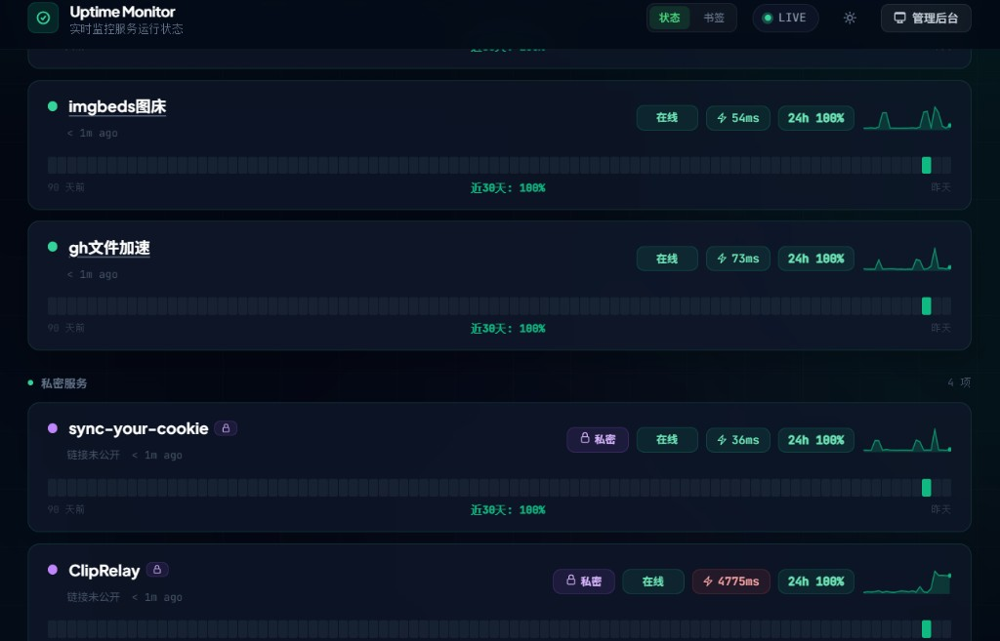
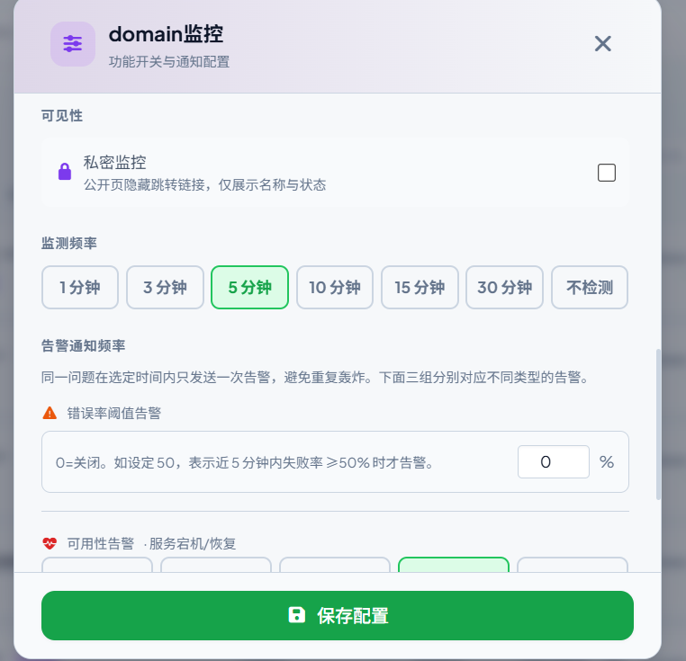
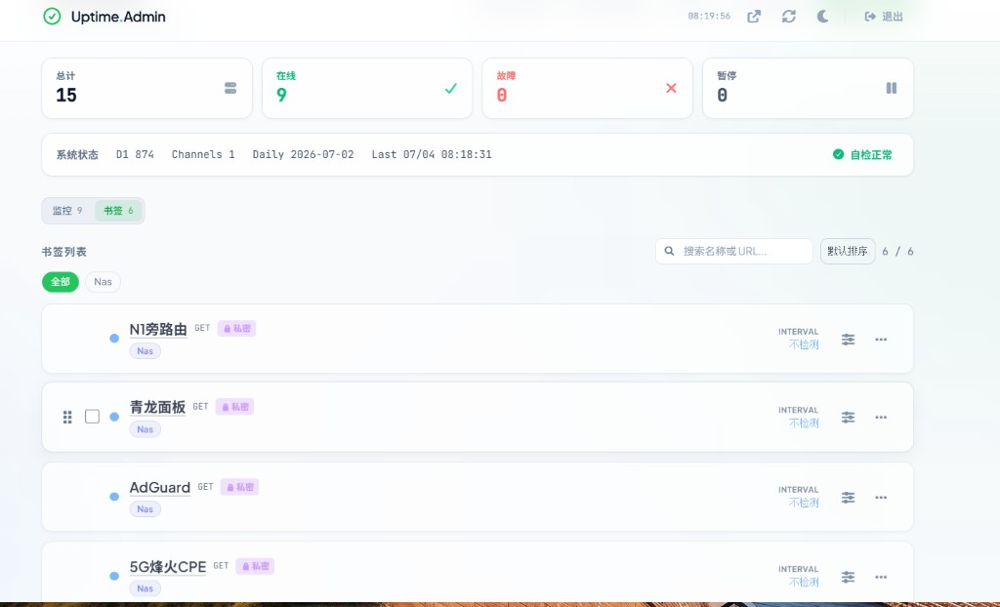

# 🌐 Uptime Monitor

<div align="center">

**基于 Cloudflare Workers + Pages + D1 的轻量级网站监控与书签导航**

[](LICENSE)
[](https://workers.cloudflare.com/)
[](https://developers.cloudflare.com/d1/)
[](https://vuejs.org/)
[](https://github.com/jia0327/Uptime-Monitor)

[English](README.en.md) | 中文

</div>

---

## 💡 核心理念

**监控与书签二合一 — 一套系统搞定公网可用性、证书域名告警，以及内网链接导航。**

- **检测 / 跳转分离**：探测 URL 仅用于后台健康检查，公开页只展示跳转链接
- **书签模式**：监测频率选「不检测」，收藏 NAS、旁路由等 Worker 无法访问的内网服务
- **私密监控**：公开状态页隐藏跳转链接，只显示名称与在线状态
- **零服务器**：Cloudflare 免费额度即可运行；前端字体与图标本地打包，更适合国内访问

---

## 🚀 在线 Demo

👉 **[https://uptime-monitor.onlydev.ccwu.cc](https://uptime-monitor.onlydev.ccwu.cc)**

| 路径 | 说明 |
|------|------|
| [`/`](https://uptime-monitor.onlydev.ccwu.cc/) | 公开状态页 — 监控状态、事件公告与维护窗口 |
| [`/bookmarks`](https://uptime-monitor.onlydev.ccwu.cc/bookmarks) | 书签页 — 按标签分类的内网 / 导航链接 |
| [`/admin`](https://uptime-monitor.onlydev.ccwu.cc/admin) | 管理后台 — **Demo 不提供登录密码**，需自行部署后使用 |

> Demo 仅开放状态页与书签页。部署自己的实例见下方 [部署](#-部署)。

---

## ✨ 功能特性

### 监控与告警

| 能力 | 说明 |
|------|------|
| **HTTP/HTTPS 探测** | GET/POST、自定义 Header、请求 Body、关键词校验 |
| **灵活频率** | 1 / 3 / 5 / 10 / 15 / 30 分钟，或 **不检测**（书签模式） |
| **SSL / 域名到期** | 独立开关与提前提醒阈值 |
| **多通道通知** | 企业微信、飞书、钉钉、Webhook、Telegram、Email |
| **告警模板** | 异常与恢复分离；可用性 / SSL / 域名三类静默窗口 |

### 状态页与书签

| 能力 | 说明 |
|------|------|
| **公开状态页** | 标签分组、事件公告、计划维护、自定义 Logo；**近 7 天**可用率条与 24h/7d 统计 |
| **独立书签页** | `/bookmarks` 按标签分类展示，与监控条目分离 |
| **跳转链接交互** | 名称带下划线可点击，悬停显示完整 URL；检测 URL 不在列表展示 |
| **私密监控** | 公开页隐藏跳转链接，仅展示名称与状态 |
| **快捷管理入口** | 状态页顶部直达 `/admin`，无需滚到页脚 |

### 管理后台

| 能力 | 说明 |
|------|------|
| **列表交互** | 名称带下划线跳转，检测 URL 隐藏，悬停查看完整链接 |
| **标签输入** | 从已有标签快速选择，或输入新标签（逗号分隔） |
| **批量与排序** | 批量操作、拖拽排序、配置导入导出、健康检查 |
| **会话认证** | 登录会话令牌，前端不长期保存明文口令 |
| **跨域收紧** | Worker 与 Pages 代理支持 `ALLOWED_ORIGIN` |
| **自动部署** | GitHub Actions 推送 `main` 自动更新 Worker 与 Pages |

### 五种监控模式

| 模式 | 公开页 | HTTP 检测 | 典型用途 |
|------|--------|-----------|----------|
| **普通监控** | 名称（下划线跳转）+ 状态 | 是 | 公网网站、API |
| **检测/跳转分离** | 名称（下划线跳转）+ 状态 | 是 | 健康检查端点与登录页不同 |
| **书签（不检测）** | 名称（下划线跳转） | 否 | 内网 NAS、旁路由 |
| **私密监控** | 名称 + 状态，**隐藏链接** | 是 | 敏感管理面板 |
| **书签 + 私密** | 名称，**隐藏链接** | 否 | 内网敏感服务链接 |

---

## 解决什么痛点

| 痛点 | 本仓库怎么做 |
| :--- | :--- |
| 公网监控与内网导航要两套工具 | **监控 + 书签二合一**，同一套状态页与管理后台 |
| 健康检查 URL 不想公开 | **检测 / 跳转分离**，探测 URL 仅后台使用 |
| NAS / 旁路由 Worker 无法探测 | **「不检测」书签模式** + 独立 `/bookmarks` 页 |
| 敏感管理面板链接不宜公开 | **私密监控**，公开页只显示名称与状态 |
| 国内访问与通知体验 | 前端资源本地打包；**企微 / 飞书 / 钉钉**优先 |

---

## 🆚 对比差异

| | **本仓库** | **[原版 nianshu2022](https://github.com/nianshu2022/Uptime-Monitor)** | **UptimeRobot 等 SaaS** |
| :--- | :---: | :---: | :---: |
| 定位 | 监控 + 书签导航 | 公网站点可用性监控 | 托管 SaaS 监控 |
| 检测 / 跳转 URL 分离 | ✅ | ❌ 同一 URL | 🟡 有限 |
| 书签模式（不检测） | ✅ `/bookmarks` | ❌ | ❌ |
| 私密监控 | ✅ 公开页隐藏链接 | ❌ | 🟡 视方案而定 |
| 状态页链接 | 名称下划线跳转 | 名称 + 独立 URL 行 | 固定模板 |
| 管理后台 | 监控 / 书签分 Tab | 混合列表 | — |
| 标签输入 | ✅ 快速选择已有 | 手动输入 | — |
| 自托管 / 数据自控 | ✅ CF 免费额度 | ✅ CF 免费额度 | ❌ |
| SSL / 域名到期 | ✅ | ✅ | 🟡 部分付费 |
| 国内通知渠道 | ✅ 企微 / 飞书 / 钉钉 | ✅ | 🟡 |

- **本仓库** — 监控 + 内网书签 + 检测跳转分离 + 私密监控
- **[原版](https://github.com/nianshu2022/Uptime-Monitor)** — 轻量公网 uptime 监控，快速上手
- **SaaS 监控** — 零部署，但数据、定制与内网场景受限

> 从原版升级时，请执行下方 [部署](#-部署) 中的增量 SQL（`is_private`、`link_url` 等字段）。

---

## 🎯 适合谁

| 用户 | 场景 |
|------|------|
| 个人站长 | 监控博客、文档站、API、图床、反代服务 |
| 独立开发者 | 为产品准备公开状态页与告警后台 |
| 小团队 | 低成本监控网站、证书、域名与关键 HTTP 服务 |
| 内网 / 混合环境 | 「不检测」模式收藏 NAS、旁路由等无法外网探测的链接 |
| Cloudflare 用户 | 直接跑在 Workers、Pages 和 D1 上，无需维护服务器 |

不适合需要复杂探针网络、企业级 SLO 报表、值班排班和多租户权限的大型团队。

---

## 🖼️ 界面预览

<div align="center">
  
  <br>
  <em>公开状态页 — 实时监控、近 7 天 uptime 条与私密服务分组</em>
</div>

<br>

<div align="center">
  
  <br>
  <em>监控配置 — 私密监控、监测频率与告警静默窗口</em>
</div>

<br>

<div align="center">
  
  <br>
  <em>管理后台 — 监控 / 书签分 Tab，内网链接与标签筛选</em>
</div>

---

## 🏗️ 技术架构

```
┌─────────────┐     ┌──────────────────┐     ┌─────────────────────┐
│  Frontend   │────▶│  Pages Proxy     │────▶│  Hono Worker        │
│  Vue 3 SPA  │     │  /api/* 转发     │     │  + D1 + Cron 探测   │
└─────────────┘     └──────────────────┘     └─────────────────────┘
                                                      │
                                                      ▼
                                               ┌──────────────┐
                                               │  目标站点    │
                                               │  SSL / 域名  │
                                               │  通知渠道    │
                                               └──────────────┘
```

| 层级 | 技术 |
|------|------|
| 后端 | Cloudflare Workers + Hono |
| 数据库 | Cloudflare D1 |
| 前端 | Vue 3 + Vite + Tailwind CSS |
| 边缘代理 | Cloudflare Pages Functions |
| CI/CD | Wrangler + GitHub Actions |

### 探测调度与 D1 优化

| 项目 | 说明 |
|------|------|
| **Cron 调度** | `* * * * *`（每分钟触发）；实际是否探测由每条监控的 `interval` 决定（1 / 3 / 5 / 10 / 15 / 30 分钟） |
| **统计展示** | 状态页与 `/monitors/public/details` 返回 **24h / 7d** 可用率；`daily_stats` 与 uptime 条仅含 **近 7 天** |
| **数据保留** | `daily_uptime` 日汇总保留 **30 天**；原始 `logs` 保留 **30 天**（每监控最多 500 条） |
| **读优化** | 公开详情 **60s 边缘缓存**；`daily_uptime` 写入时增量汇总 + 每日聚合；索引 **一次性** 初始化；维护窗口 **5 分钟** 内存缓存 |
| **写优化** | 定时任务跳过 **暂停 / 书签**（`interval = 0`）监控；状态页前端 **120s** 轮询，降低 D1 读压力 |

**权衡**：恢复分钟级 Cron 可加快故障发现与 `RETRYING` 重试粒度，Worker 调用次数会上升；上述读缓存与日汇总可将状态页 D1 查询控制在较低水平。若监控数量很多且仍接近 D1 免费额度，可适当增大单条 `interval` 或调大 `PUBLIC_DETAILS_CACHE_TTL`（需改 Worker 代码）。

> Cron 配置位于 `worker/wrangler.example.toml` 与 `.github/workflows/deploy.yml` 生成的 `wrangler.toml`；部署后无需额外环境变量。

---

## 📋 快速了解

| 问题 | 回答 |
|------|------|
| 是否需要服务器 | 不需要，部署到 Cloudflare Workers、Pages 和 D1 |
| 是否支持书签 / 内网链接 | 支持，监测频率选「不检测」 |
| 是否支持私密监控 | 支持，公开页隐藏跳转链接 |
| 是否支持告警 | 企业微信、飞书、钉钉、Webhook、Telegram、Email |
| 是否适合国内用户 | 前端资源本地打包；通知优先推荐企业微信、飞书、钉钉 |
| 状态页统计窗口 | 展示近 **7 天**可用率条；后台 `daily_uptime` 保留 **30 天** |
| 探测调度频率 | Worker Cron **每分钟**触发，按各监控 `interval` 决定是否实际 HTTP 探测 |

---

## 🔗 配套工具与推荐配置

本仓库专注 **HTTP 可用性、延迟与 DOWN/UP 告警**。若还需域名到期提醒与 Cloudflare 免费额度监控，可与同系列配套项目组合使用，各司其职、避免重复告警。

### 职责划分

| 工具 | 职责 |
|------|------|
| **Uptime Monitor**（本仓库） | HTTP 可用性、延迟、DOWN/UP 告警 |
| **[domain-autocheck](https://github.com/jia0327/domain-autocheck)** | 域名 WHOIS / 到期、续费提醒、多注册商、DNSHE 导入、CF NS 徽章 |
| **[CF-Quota-Dashboard](https://github.com/jia0327/CF-Quota-Dashboard)** | CF 账号免费额度（D1 / KV / Workers 等）、阈值告警、多账号 |

### 各类型监控的推荐配置

**1. CF 托管服务（Workers / Pages、橙云代理）**

- 关闭 **SSL 证书到期**检查（CF Universal SSL 自动续期）
- 关闭 **域名到期**检查（交由 [domain-autocheck](https://github.com/jia0327/domain-autocheck) 负责）
- 探测 URL 使用轻量健康端点，如 `/api/health`，避免 SPA 管理页 `/admin`
- 非关键服务 `interval` 建议 **≥ 5 分钟**，降低 D1 读压力

**2. 书签 / 内网 NAS（`interval = 0`）**

- 关闭 SSL 与域名检查
- 不进行 HTTP 探测，仅作跳转导航

**3. 自托管 / 非 CF 源站（手动 SSL）**

- 按需保留 SSL 检查
- 域名检查可选；若已部署 domain-autocheck，建议在 Uptime Monitor 中关闭，避免重复告警

### 生态组合清单

- 三个项目均可部署在 **Cloudflare 免费额度**上
- 在 Uptime Monitor 中为 **domain-autocheck** 与 **CF-Quota-Dashboard** 的 Worker 本身添加健康检查
- **避免重复告警**：domain-autocheck 已覆盖的域名到期提醒，请在 Uptime Monitor 中关闭对应开关
- 使用 [CF-Quota-Dashboard](https://github.com/jia0327/CF-Quota-Dashboard) 关注 D1 读写趋势（尤其 Uptime Monitor 优化后仍接近额度时）

> 配套项目：[domain-autocheck](https://github.com/jia0327/domain-autocheck) · [CF-Quota-Dashboard](https://github.com/jia0327/CF-Quota-Dashboard)

---

## 🛠️ 部署

### 前置要求

- Cloudflare 账号
- Node.js 22 或更高版本
- npm
- Wrangler CLI

```bash
npm install -g wrangler
wrangler login
```

克隆项目：

```bash
git clone https://github.com/jia0327/Uptime-Monitor.git
cd Uptime-Monitor
```

### 创建 D1 数据库

新建数据库：

```bash
npx wrangler d1 create uptime-db
```

命令输出中会包含 `database_id`，后续部署需要使用：

```toml
[[d1_databases]]
binding = "DB"
database_name = "uptime-db"
database_id = "xxxxxxxx-xxxx-xxxx-xxxx-xxxxxxxxxxxx"
```

初始化表结构：

```bash
npx wrangler d1 execute uptime-db --remote --file=worker/schema.sql
```

如果数据库之前已经创建过，可以在 Cloudflare Dashboard 的 D1 数据库详情页复制 Database ID，也可以执行：

```bash
npx wrangler d1 list
```

已有数据库升级时，请使用 `worker/schema.sql` 文件末尾注释中的 **增量迁移** 语句，不要直接执行完整建表脚本（会清空数据）。

若升级至支持「私密监控」的版本，需执行：

```bash
npx wrangler d1 execute uptime-db --remote --command="ALTER TABLE monitors ADD COLUMN is_private INTEGER DEFAULT 0;"
```

若升级至支持「检测/跳转链接分离」的版本，需执行：

```bash
npx wrangler d1 execute uptime-db --remote --command="ALTER TABLE monitors ADD COLUMN link_url TEXT;"
```

「不检测 / 书签」模式使用 `interval = 0`，无需额外数据库字段。若列已存在，SQLite 会报错，可忽略。

### 部署前检查清单

上线前请确认下面 4 项都已完成：

- 远程 D1 已执行 `worker/schema.sql`。
- Worker 已绑定 D1，且绑定名是 `DB`。
- Worker 已配置 `ADMIN_API_KEY`。
- Pages 已配置 `WORKER_URL`，并在保存后重新部署前端。

如果少了最后一步，登录接口会返回：

```json
{"error":"WORKER_URL environment variable is not set"}
```

如果少了 D1 初始化，公开接口或登录后的管理接口可能返回：

```json
{"error":"D1_ERROR: no such table: monitors: SQLITE_ERROR"}
```

### 手动部署

#### 1. 配置并部署 Worker

```bash
cd worker
npm install
cp wrangler.example.toml wrangler.toml
```

编辑 `worker/wrangler.toml`：

```toml
[[d1_databases]]
binding = "DB"
database_name = "uptime-db"
database_id = "你的 D1_DATABASE_ID"

[vars]
ADMIN_API_KEY = "你的管理后台登录口令"
ALLOWED_ORIGIN = "https://你的-pages域名.pages.dev"
SESSION_TTL_HOURS = "12"
```

注意：`binding` 必须保持为 `DB`。

部署 Worker：

```bash
npx wrangler deploy
```

部署完成后复制 Worker 地址，例如：

```text
https://uptime-worker.example.workers.dev
```

#### 2. 构建并部署前端

```bash
cd ../frontend
npm install
cp .env.example .env
npm run build
npx wrangler pages deploy dist --project-name=uptime-monitor
```

#### 3. 配置 Pages 环境变量

进入 Cloudflare Dashboard：

`Workers & Pages` -> `uptime-monitor` -> `Settings` -> `Environment variables`

添加：

| 变量 | 说明 |
|------|------|
| `WORKER_URL` | Worker 地址，例如 `https://uptime-worker.example.workers.dev` |
| `ALLOWED_ORIGIN` | Pages 地址，例如 `https://uptime-monitor.pages.dev` |

保存后重新部署前端：

```bash
npx wrangler pages deploy dist --project-name=uptime-monitor
```

验证代理是否生效：

```bash
curl https://你的-pages域名.pages.dev/api/monitors/public
```

正常情况下会返回 `[]` 或监控列表。如果返回 `WORKER_URL environment variable is not set`，说明 Pages 环境变量未配置或配置后没有重新部署。

### GitHub Actions 自动部署

克隆本仓库后，在 GitHub 仓库的 `Settings` -> `Secrets and variables` -> `Actions` 中配置以下内容。

#### Secrets

| 名称 | 必填 | 说明 |
|------|------|------|
| `CLOUDFLARE_API_TOKEN` | 是 | Cloudflare API Token |
| `CLOUDFLARE_ACCOUNT_ID` | 是 | Cloudflare Account ID |
| `D1_DATABASE_ID` | 是 | D1 数据库 ID |
| `ADMIN_API_KEY` | 是 | 管理后台登录口令 |
| `VITE_CF_ANALYTICS_TOKEN` | 否 | Cloudflare Web Analytics Token |

Cloudflare API Token 至少需要这些权限：

| 权限 | 级别 |
|------|------|
| Account / Workers Scripts | Edit |
| Account / Cloudflare Pages | Edit |
| Account / D1 | Edit |
| Account / Account Settings | Read |

#### Variables

| 名称 | 必填 | 说明 |
|------|------|------|
| `ALLOWED_ORIGIN` | 推荐 | Pages 地址，用于限制跨域来源 |
| `SESSION_TTL_HOURS` | 否 | 登录会话有效期，默认 12 小时 |
| `VITE_FOOTER_AUTHOR` | 否 | 页脚作者名 |
| `VITE_FOOTER_URL` | 否 | 页脚作者链接 |

配置完成后，推送到 `main` 分支或在 Actions 页面手动运行 `Deploy Uptime Monitor` 工作流。

首次部署完成后，还必须在 Cloudflare Pages 项目中添加 `WORKER_URL` 环境变量，然后重新部署一次前端。GitHub Secrets 里的 `D1_DATABASE_ID` 只用于 Worker 绑定，不会自动给 Pages 配置后端地址。

操作路径：

`Cloudflare Dashboard` -> `Workers & Pages` -> `uptime-monitor` -> `Settings` -> `Environment variables`

添加：

| 变量 | 值 |
|------|-----|
| `WORKER_URL` | Worker 地址，例如 `https://uptime-worker.example.workers.dev` |
| `ALLOWED_ORIGIN` | Pages 地址，例如 `https://uptime-monitor.pages.dev` |

保存后回到 GitHub Actions 重新运行一次部署，或本地执行：

```bash
cd frontend
npm run build
npx wrangler pages deploy dist --project-name=uptime-monitor
```

---

## 💻 本地开发

启动 Worker：

```bash
cd worker
npm install
npm run dev
```

启动前端：

```bash
cd frontend
npm install
npm run dev
```

访问：

- 状态页：`http://localhost:5173/`
- 书签页：`http://localhost:5173/bookmarks`
- 管理后台：`http://localhost:5173/admin`
- Worker：`http://127.0.0.1:8787`

---

## 🇨🇳 国内访问说明

`workers.dev` 域名在中国大陆可能无法直接访问。推荐将前端部署到 Cloudflare Pages，并通过 Pages 内置代理把 `/api/*` 请求转发到 Worker。

如需更稳定访问，可以绑定自定义域名：

- Worker：`Workers & Pages` -> Worker -> `Settings` -> `Domains & Routes`
- Pages：`Workers & Pages` -> Pages 项目 -> `Custom domains`

项目不依赖需要付费的第三方服务。Telegram、Email、`crt.sh`、`rdap.org` 等外部服务可能受网络环境影响，国内用户建议优先使用企业微信、飞书、钉钉或自定义 Webhook。

---

## ❓ 常见问题

### GitHub Actions 提示 Cloudflare Authentication error

通常是 GitHub Secrets 配置错误或 API Token 权限不足。请检查：

- `CLOUDFLARE_API_TOKEN` 是否正确。
- `CLOUDFLARE_ACCOUNT_ID` 是否正确。
- API Token 是否包含 Workers、Pages、D1 和 Account Settings 权限。
- Token 的账号资源范围是否包含目标 Cloudflare 账号。

### Worker 报错 Cannot read properties of undefined (reading 'prepare')

说明 D1 没有正确绑定。请检查：

- `worker/wrangler.toml` 中 `binding` 是否为 `DB`。
- `database_id` 是否填写正确。
- GitHub Actions 中 `D1_DATABASE_ID` 是否已配置。

### 登录后台提示认证未配置

请配置 `ADMIN_API_KEY`。本项目兼容旧的 `ADMIN_PASSWORD`，但推荐使用 `ADMIN_API_KEY`。

### `/api/monitors/public` 返回前端页面

说明 Pages 代理没有拿到 Worker 地址。请在 Cloudflare Pages 环境变量中配置 `WORKER_URL`，保存后重新部署前端。

### 登录接口返回 500，并提示 WORKER_URL environment variable is not set

这是 Pages 项目缺少 `WORKER_URL`。请在 Cloudflare Pages 项目环境变量中添加：

```text
WORKER_URL=https://你的 Worker 地址
```

保存后必须重新部署 Pages，否则新变量不会生效。

### 接口返回 D1_ERROR: no such table: monitors

说明当前 Worker 绑定的 D1 数据库还没有初始化表结构，或 `D1_DATABASE_ID` 绑定到了另一个空库。

先确认 D1：

```bash
npx wrangler d1 list
```

然后初始化远程数据库：

```bash
npx wrangler d1 execute uptime-db --remote --file=worker/schema.sql
```

---

## 📁 目录结构

```text
Uptime-Monitor/
├── frontend/
│   ├── public/
│   │   └── _worker.js
│   ├── index.html
│   ├── src/
│   ├── vite.config.js
│   └── package.json
├── worker/
│   ├── src/index.ts
│   ├── schema.sql
│   ├── wrangler.example.toml
│   └── package.json
├── .github/workflows/
│   └── deploy.yml
├── docs/
│   └── LAUNCH.md
├── README.md
├── README.en.md
└── LICENSE
```

---

## 📄 License

本项目基于 [MIT License](LICENSE) 开源。

---

## 🙏 致谢

- [Cloudflare](https://www.cloudflare.com/) 平台
- 基于 [nianshu2022/Uptime-Monitor](https://github.com/nianshu2022/Uptime-Monitor) 增强
- 同系列项目：[CF-Quota-Dashboard](https://github.com/jia0327/CF-Quota-Dashboard) — Cloudflare 多账号免费额度监控

---

<div align="center">

**[⬆ 回到顶部](#-uptime-monitor)**

Made with ❤️ by [jia0327](https://github.com/jia0327)

</div>
